# Analisando imagens

1 - Acessamos o link <https://portal.azure.com/> e criamos o recurso, na opção Create a resource.

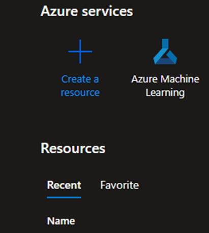
 
 
 

2 - Dentro de AI + Machine Learning, selecionar a opção Azure AI services.

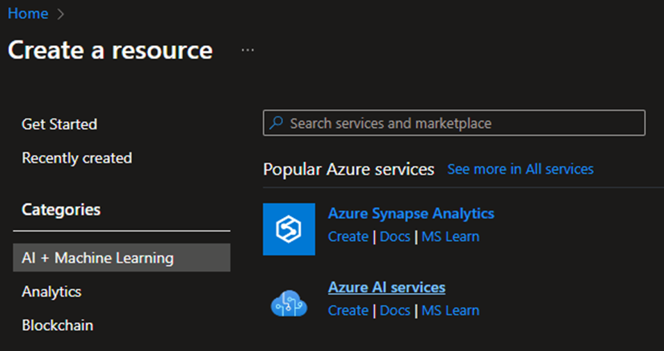
 
 
 

3 - Configuramos as opções e criamos o recusrso.

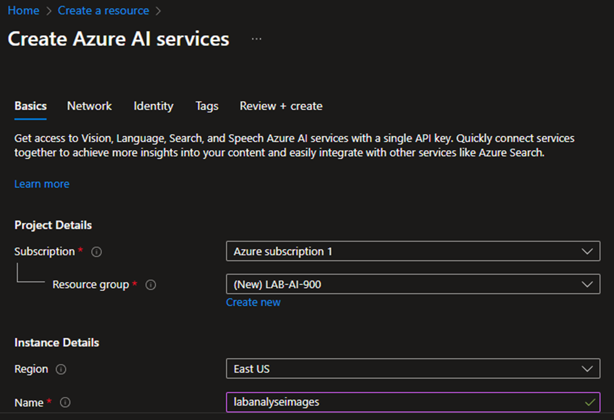
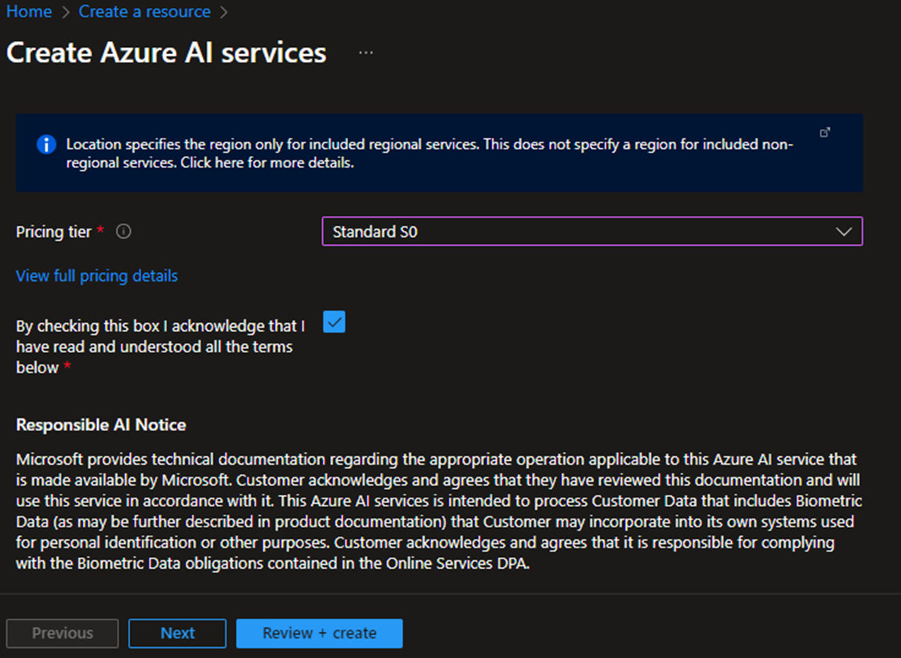
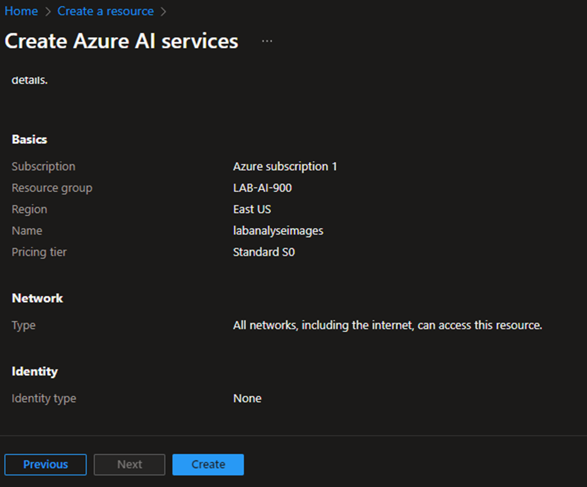
 
 
 

4 - Acessamos  o link <https://portal.vision.cognitive.azure.com/>. Selecionamos a View all resource, para visualiuzar todos os recursos exixtentes. Selecionamos o recurso criado e definimos ele como padrão, na opção Select as default resource.
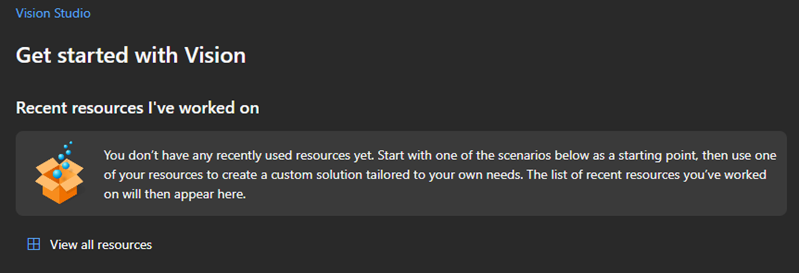
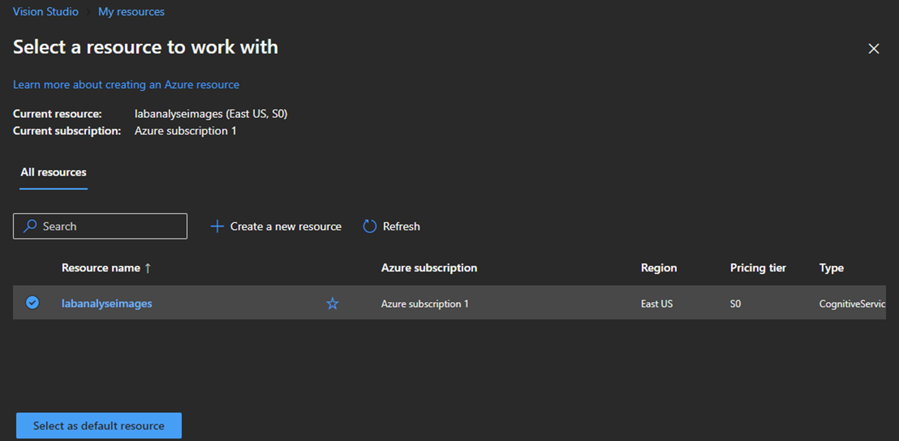
 
 
 

## Para detectar faces em imagens

1 - Dentro da aba Face, selecioanos a opção Detect faces in an image.
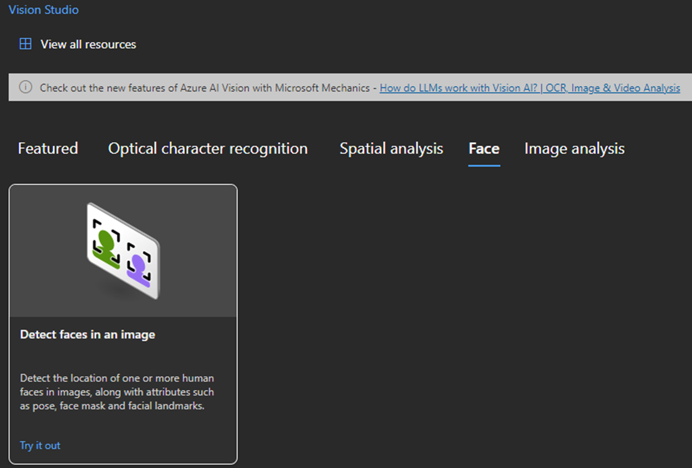
 
 
 

2 - Selecionamos a imagem que queremos detectar as faces.
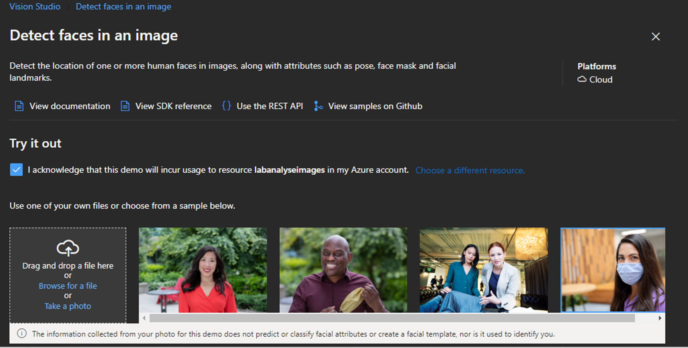
 
 
 

3 - Abaixo na pagina é exibida a imagem selecionada e o resultado ao lado. São exibidos os atributos detectados e o JSON.
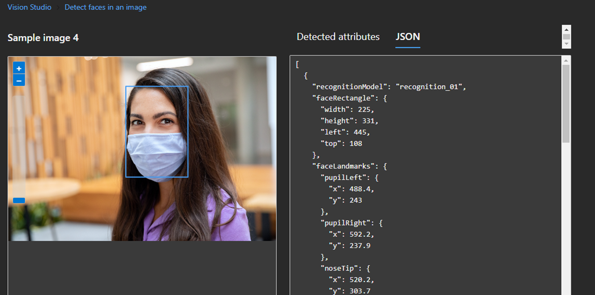
 
 
 

## Para detectar textos em imagens

1 - Dentro da aba Optical character recognition, selecioanos a opção Extract text from images.
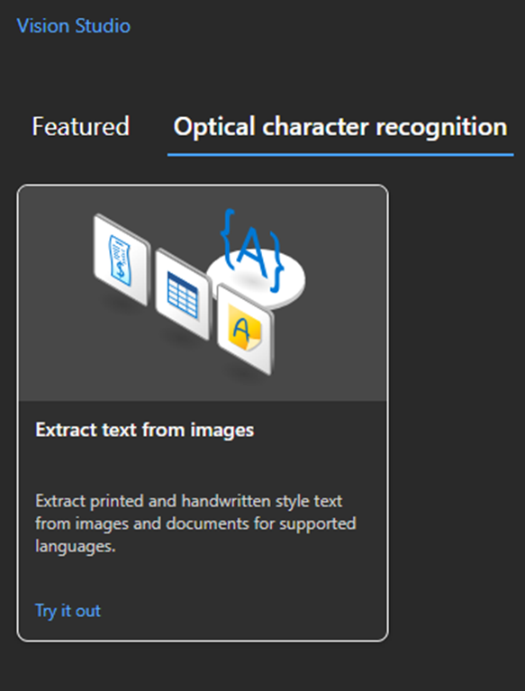
 
 
 

2 - Selecionamos a imagem que queremos detectar os textos.
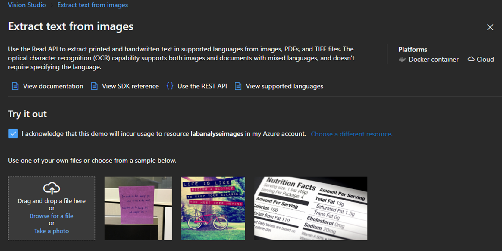
 
 
 

3 - Abaixo na pagina é exibida a imagem selecionada e o resultado ao lado. São exibidos os textos detectados e o JSON.
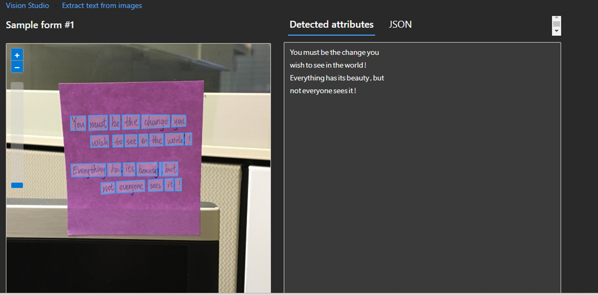
 
 
 

## Para gerar captions de imagens

1 - Dentro da aba Image analysis, selecioanos a opção Add captions to image.
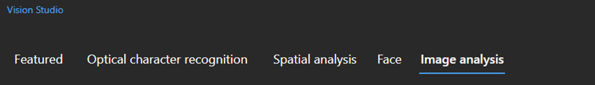
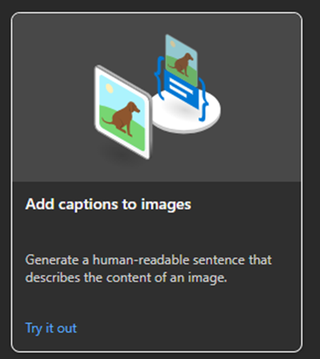
 
 
 

2 - Selecionamos a imagem que queremos que seja analisada.
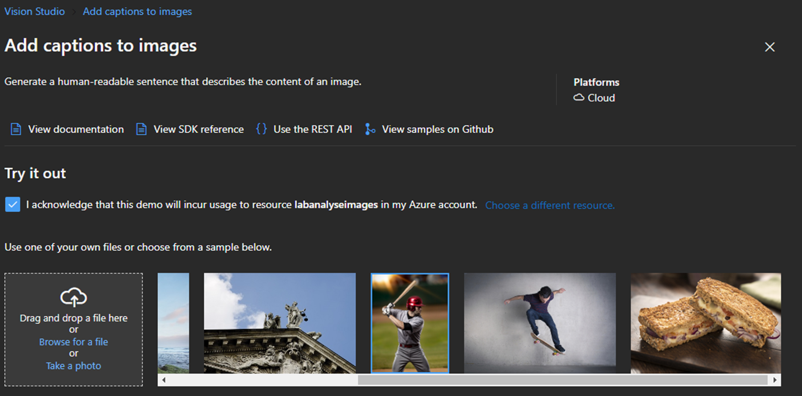
 
 
 

3 - Abaixo na pagina é exibida a imagem selecionada e o resultado ao lado. São exibidos a descrição da imagem e o JSON.
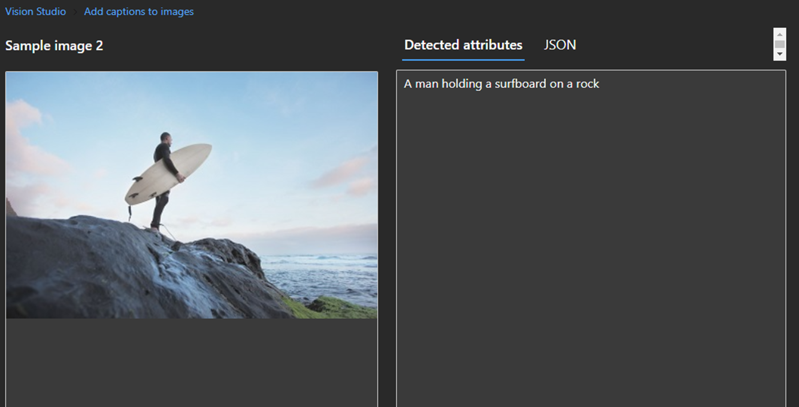